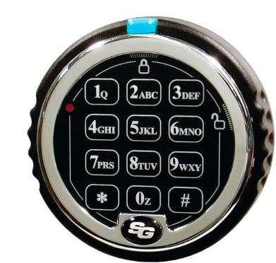
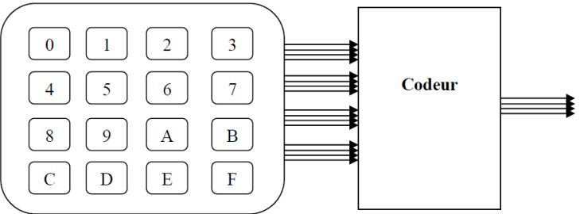
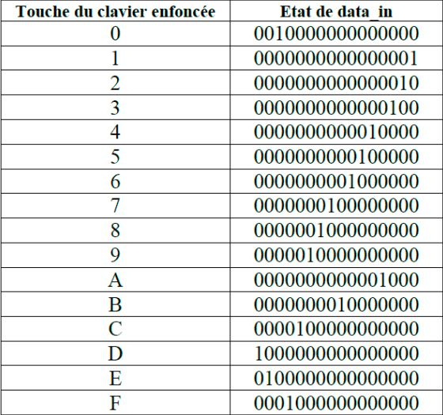
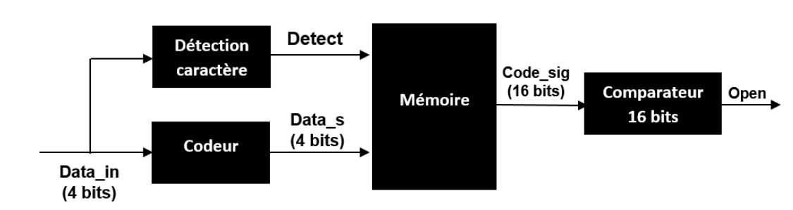
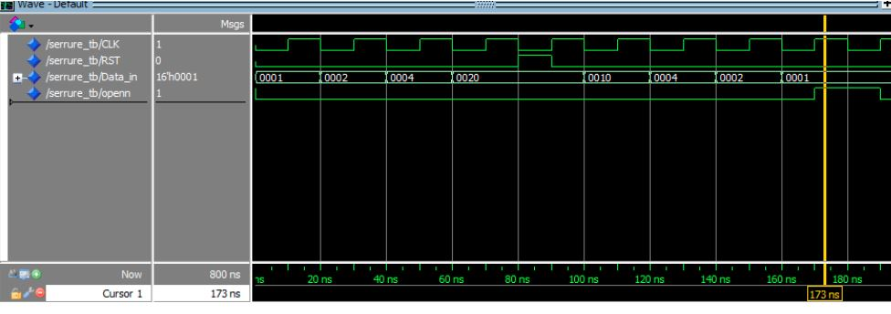

<h1 align='center'>VHDL Design and Simulation of an Electronic Combination Lock.</h1>

<p align="center"> </p> 

## Definition of VHDL

* The VHSIC Hardware Description Language is a hardware description language that can model the behavior and structure of digital systems at multiple levels of abstraction, ranging from the system level down to that of logic gates, for the purposes of design entry, documentation, and verification.
* The abbreviation VHDL stands for VHSIC Hardware Description Language (VHSIC: Very High Speed Integrated Circuit). This language was developed in the 1970s to provide a high-level language suitable for the functional description of complex systems.


## Objectives
* The primary objective of this project is to model an electronic combination lock circuit using VHDL language, and then validate the elaborated description by simulating it using Modelsim software.
 
* This project will provide an opportunity to review the descriptions provided by the VHDL language and to develop a good understanding of the different algorithmic structures that form the basis of these approaches.
 
* Each description created must be accompanied by a test bench that validates it.

* Before each component is modeled, in-depth research into its operation is required.


## INTRODUCTION

A lock is a mechanism operated with a key, used to block a door or an opening in the closed position.
The project aims to create a lock composed of:

* Encoder: its role is to translate the code generated by the keyboard and transmitted through the data_in bus into a 4-bit binary code that will be sent to the system via the data_s bus.
Detector: its role is to detect a key press and set the detect signal to 1. If no key press is detected, the output signal is set to 0.
* Memory: its role is to store the code entered by the user. It consists of 4 parallel 4-bit read/write registers active on the rising edge. When the Detect signal goes high, the value on the encoder output (data_s) is stored in the first register, and the previous values in the other registers are shifted by one register. The code_sig bus receives the values of the four registers. The first 4 bits of this bus represent the value of the first register, corresponding to the last pressed key.
* Comparator: its role is to detect the equality of two values coded on 16 bits as input. The key for the lock that will be used as a comparison base (fixed_key) is set to 1234. When the code entered by the user is equal to the key code, the open signal goes to 1; otherwise, the open signal remains at 0. To develop the VHDL description of the 16-bit comparator, it is necessary to first create the description of a 4-bit comparator and then make the necessary connections.

## Presentation of the Lock Circuit

An electronic combination lock requires the input of a confidential code (numbers and/or letters) to be unlocked. In the case of the lock that will be the subject of this project, the code consists of 4 numbers that need to be typed on a keyboard with 16 numeric keys connected to the lock. Each key is connected to the lock's encoder via a wire of the 16-bit binary data bus (data_in). The connections with the encoder are shown in the following figure:

 <p align="center"> </p> 


All wires of the bus are at a low level as long as no key is pressed. Pressing one of the keys raises the wire connecting it to the encoder to a high level, while the other wires remain at a low level. The following table shows the state of the data bus when pressing different keys on the keyboard.




## L’architecture globale du circuit de la serrure
L’architecture globale du circuit de la serrure est représentée sur la figure suivante :
 <p align="center"> </p> 
 
## The overall architecture of the lock circuit
1.The overall architecture of the lock circuit is depicted in the following figure:

| Component      | Role | Explanation     |
| :----:      |    :----:   |        :----: |
| Encoder      | The role of the encoder is to translate the code generated by the keyboard and transmitted via the data_in bus into 4-bit binary code, which will be sent to the system via the data_s bus.       | The Encoder has a 16-bit Data_in input and a 4-bit Data_s output. Each lock key is coded on 16 bits, so when the user presses a key, Data_in receives its binary code, and according to the process, each key is transformed into 4 bits based on the transformations in the table above.  |
| Flip-Flop |    |   To model memory in VHDL, a description of a modified D flip-flop active on rising edge is necessary. It has a reset signal "RST" that asynchronously resets the output Q and an Enable (detect) input that transfers the input to the output when it is 1. The flip-flop has four inputs (D, CLK, RST, enable) of type Std logic and a single output (Q) of type std_logic. RST: Signal that asynchronously resets the output Q. Clock: to determine if the D flip-flop is active on the rising edge. Enable: Signal that activates the transfer of the input to the output when it is 1. |
| Register |    |   To model memory, a 4-bit parallel Read/Write register needs to be implemented, based on modified D flip-flops active on rising edge.   |
|  Memory|   Its role is to store the code entered by the user. It consists of 4 parallel 4-bit Read/Write registers active on rising edge. |  When the Detect signal goes high, the value present on the encoder's output (data_s) is stored in the first register, and the previous values in the other registers are shifted by one register. The code_sig bus receives the values from the four registers. The first 4 bits of this bus represent the value of the first register, which corresponds to the last pressed key digit.|
| 4-Bit Comparator |The role of the 4-bit comparator is to detect equality between two 4-bit coded values    | The comparator has two inputs A, B coded on 4 bits and one output EQU on 1 bit. A and B inputs are included in the sensitivity list. The output will be 1 if the two numbers are equal.     |
|16-Bit Comparator  |Its role is to detect equality between two 16-bit coded input values. The lock key used for comparison (fixed_key) is set to 1234.    | When the code entered by the user matches the key code, the "open" signal goes high; otherwise, the "open" signal remains low.  |
| LOCK |    | To model the entire lock: all components, encoder, detector, memory, and comparator are instantiated, and the inputs and outputs of the components are connected with internal signals DATA_S, detect, code_sig, and external signals Data-in and open. |


2. Lock Code

```
LIBRARY IEEE;
USE IEEE.STD_LOGIC_1164.ALL;
USE IEEE.STD_LOGIC_UNSIGNED.ALL;

Entity Serrure is --entité
port(
DATA_in : in std_logic_vector(15 downto 0);
CLK : in std_logic;
RST : in std_logic;
openn : out std_logic);
End Serrure ;
Architecture ARCS of Serrure is -- architecture
component detecteur is
port(
Data_in: in std_logic_vector(15 downto 0);
Detect: out std_logic);
end component;
component Memoire
port(
DATA_s : in std_logic_vector(3 downto 0);
clk,RST,enable :in std_logic;
code_sig : out std_logic_vector(15 downto 0));
end component;

component cmprtr16b is
port( code_sig: in  std_logic_vector(15 downto 0);

          Openn : out  std_logic );
end component;

component codeur is
port(
Data_in: in std_logic_vector(15 downto 0);
Data_s: out std_logic_vector(3 downto 0));
end component;


--Signal CLK,RST: std_logic;
Signal Detect: std_logic ;

Signal Data_s : std_logic_vector(3 downto 0);
signal code_sig : std_logic_vector(15 downto 0);

Begin

 inst_detecteur: entity work.detecteur(ARCHI_detecteur) port map(Data_in,Detect);
 inst_codeur: entity work.codeur(ARCHI_codeur) port map(Data_in ,Data_s);
 inst_memoire: entity work.Memoire(ARC1) port map(Data_s,CLK ,RST,Detect,code_sig);

 inst_comparateur: entity work.cmprtr16b(arc16) port map(code_sig,openn);

End ARCS ;

```

3. Banc de test du serrure


```
LIBRARY IEEE;
USE IEEE.STD_LOGIC_1164.ALL;
USE IEEE.STD_LOGIC_UNSIGNED.ALL;

Entity Serrure_tb is --entité

End Serrure_tb ;
Architecture ARCS_tb of Serrure_tb is -- architecture

component Serrure
port(
DATA_in : in std_logic_vector(15 downto 0);
CLK : in std_logic;
RST : in std_logic;
openn : out std_logic);
End component;

Signal CLK,RST : std_logic;
--Signal Detect : std_logic ;
--Signal Data_s,data_s1 : std_logic_vector(3 downto 0);
--signal code_sig : std_logic_vector(15 downto 0);
signal Data_in :  std_logic_vector(15 downto 0);
signal openn :  std_logic;
Begin
inst:Serrure port map(DATA_in,CLK,RST ,openn);
--Detect_process :process is
--begin
  -- Detect <= '1';
   --wait for 200 ns;
    -- Detect <= '0';
    --wait for 1000 ns;
  
--end process;

clock_process :process is
begin
     CLK <= '0';
     wait for 10 ns;
     CLK <= '1';
     wait for 10 ns;
  
end process;

process
begin
RST <= '0';
DATA_IN <= "0000000000000001";
wait for 20 ns;
DATA_IN <= "0000000000000010";
wait for 20 ns;
DATA_IN <= "0000000000000100";
wait for 20 ns;
DATA_IN <= "0000000000010000";
wait for 20 ns;

RST <= '1';
wait for 10 ns;
RST <= '0';

wait for 10 ns;
RST <= '0';
DATA_IN <= "0000000000010000";
wait for 20 ns;
DATA_IN <= "0000000000000100";
wait for 20 ns;
DATA_IN <= "0000000000000010";
wait for 20 ns;
DATA_IN <= "0000000000000001";
wait for 20 ns;
end process;

End ARCS_tb ;
```
4. Lock Simulation



5. The code for the other components

<p>For the encoder, detector, memory, register, and comparator code, please contact me.</p>
## Conclusion

At the end of this report detailing an enrichment project, we carried out this VHDL project to create a lock, as engineering students at Euromed University of Fès. During this project, we were able to apply the theoretical knowledge acquired during our university education. It is worth noting that this project proved to be very enriching as it involved a practical approach to the engineering profession. Indeed, it required initiative and adherence to deadlines.
